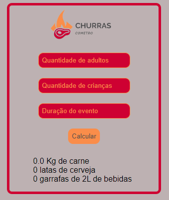

# ChurrasCometro - Desafio

# Sobre o projeto

Uma aplicação simples que calcula a quantidade de carne e bebidas para um churrasco. [Clique aqui para acessar a página](https://rafaelfrodz.github.io/Churrascometro/)

## Objetivo

Aprender como utilizar o javascript e aprimorar tecnicas em html e css.

## Screenshot do projeto

## 🚀 Tecnologias e Ferramentas Utilizadas

**HTML5**

**CSS3**

**JavaScript**

**Desenvolvido por [Rafael César](https://github.com/rafaelfrodz/)**
